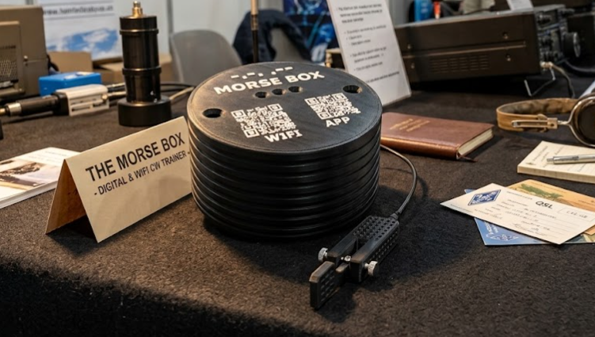
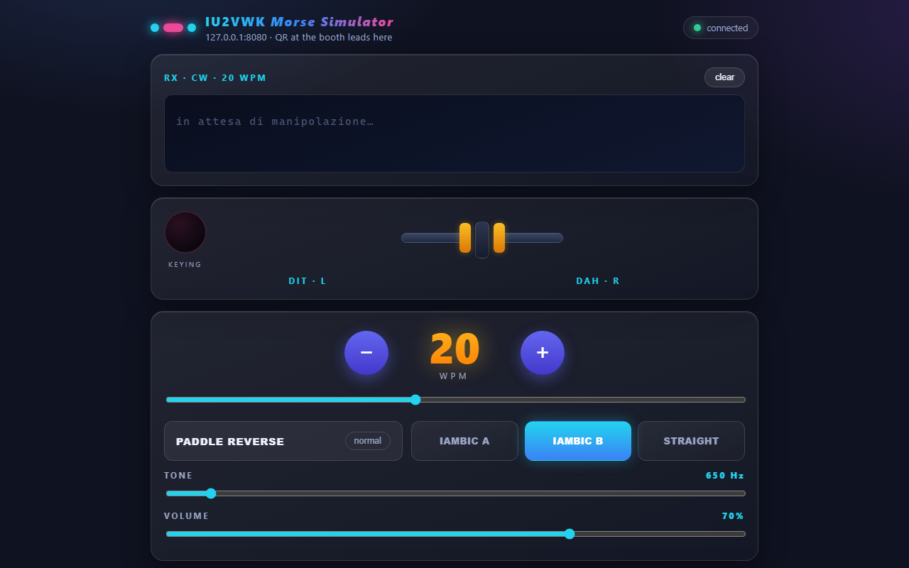
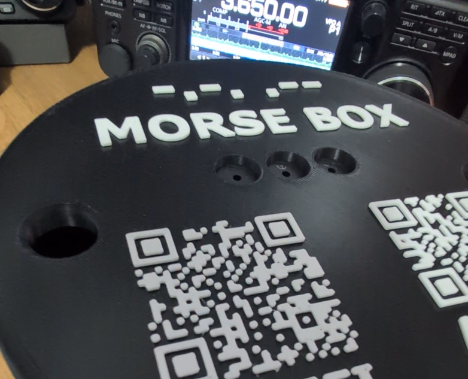
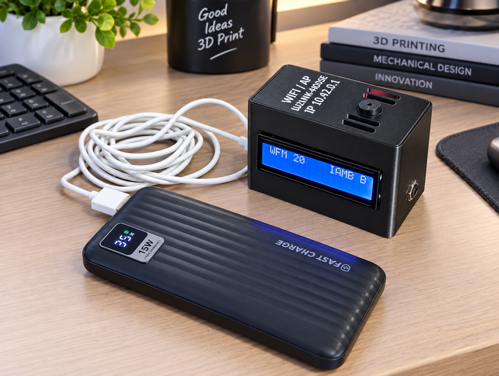
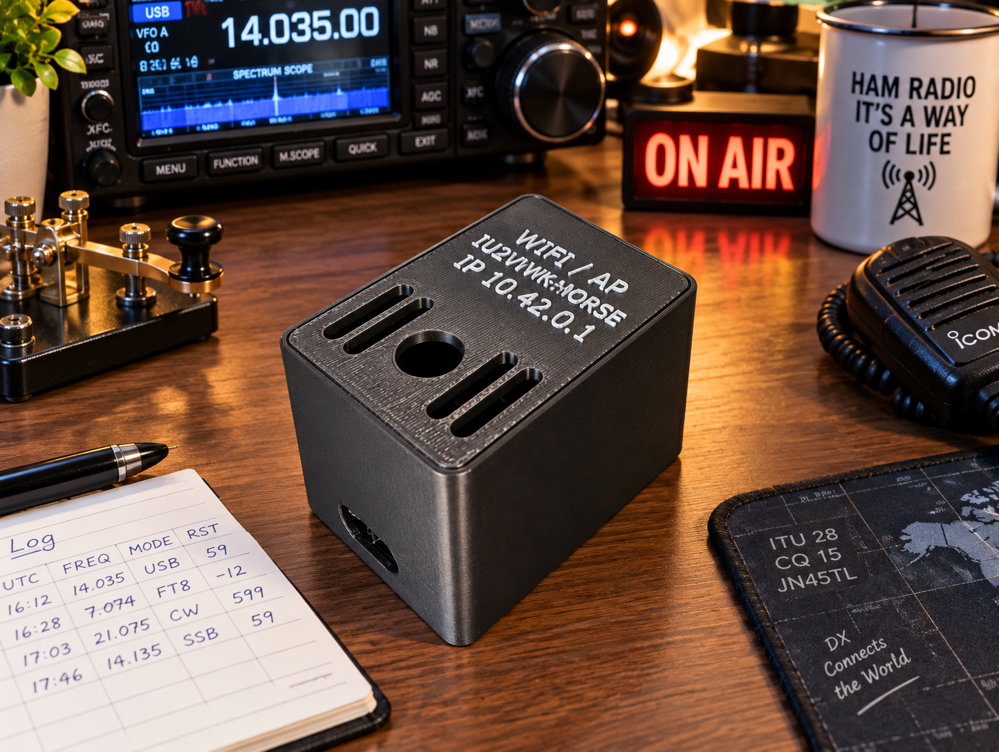

# MorseBox Mini — WiFi CW Trainer

A Morse keyer in a box. A Raspberry Pi (4, 5, Zero 2 W or similar) serves a web page over its own WiFi.
Join the network, open the page, key with a real paddle or the touch paddle on
screen, and read back your keying as text. The sidetone comes straight off the
GPIO pins with zero lag, on up to three piezo buzzers at once.

No dependencies. Plain Python 3 out of the box. No paddle handy? Touch mode
works fine without one.

> **Two versions in this repository**
> * **Raspberry Pi** — original version, files in the root (`server.py`, `install.sh`, …)
> * **ESP32 / MicroPython** — port in the [`esp32/`](esp32/) folder, with LCD1602 I2C support.
>   Wiring and setup: [`esp32/README-ESP32.md`](esp32/README-ESP32.md)

## Quick install

**Raspberry Pi** (Raspberry Pi OS) — one command:

```bash
sudo apt install -y git && git clone https://github.com/iu2vwk-ita/morsebox-mini.git morsebox && cd morsebox && sudo bash install.sh
```

**ESP32 / MicroPython** — one command (first install the tool: `pip install mpremote`):

```bash
git clone https://github.com/iu2vwk-ita/morsebox-mini.git && cd morsebox/esp32 && bash deploy.sh
```



## What it does

* Iambic A / B and straight key, 5 to 60 WPM, paddle reverse (DX⇄SX)
* Live decoded text on the web page and on the optional MAX7219 LED matrix
* Sidetone pitch (400 to 4000 Hz) and volume from the page, played on 1 to 3
  piezos together (`--buzz-pins 24,25,12`)
* Key with a paddle, a straight key, the on screen paddle, or the keyboard
  (`Z` / `X` / space)



## Open the web UI

The Pi is the access point. No home router, no internet.

1. Power the box, wait about 30 seconds
2. Join the WiFi **`IU2VWK-MORSE`** (password `morse1234`). Your phone will say
   connected without internet. That is normal, stay on it
3. Open **`http://10.42.0.1`**

The lid has two QR codes: **WIFI** joins the network, **APP** opens the page.
At home the box also works over Ethernet on port 80.

## Hardware

* Raspberry Pi (4, 5, Zero 2 W or similar) with power supply and microSD
  loaded with Raspberry Pi OS Lite 64 bit
* Paddle or straight key wired to the GPIO header. Contacts to GND, the
  internal pull ups do the rest, no extra parts
* 1 to 3 passive piezo buzzers (KY-006 3 pin modules)
* Optional MAX7219 8x8 LED matrix. Shows WPM plus live decoded text

### Wiring (BCM numbers, key contacts to GND)

| Function | GPIO | Header pin |
|----------|------|------------|
| DIT (paddle) | 17 | 11 |
| DAH (paddle) | 27 | 13 |
| Straight key | 22 | 15 |
| GND | — | 6, 9, 14… |
| Piezo 1 signal | 24 | 18 |
| Piezo 2 signal | 25 | 22 |
| Piezo 3 signal | 12 | 32 |
| MAX7219 DIN / CLK / CS | 10 / 11 / 8 | 19 / 23 / 24 |

Each KY-006 module: `S` to its signal pin, `+` (middle) to 5V (pins 2/4),
`−` to GND. All `5V` pins are one rail and all `GND` pins are one rail, so
power wires can share. Each `S` needs its own GPIO. Default buzzer mode is
`passive`. Got a self beeping active buzzer instead? Start with
`--buzzer-mode active`.



## Install

One command on Raspberry Pi OS (clones the repo and installs everything):

```bash
sudo apt install -y git && git clone https://github.com/iu2vwk-ita/morsebox-mini.git morsebox && cd morsebox && sudo bash install.sh
```

That sets the hostname to `iu2vwk-morse`, installs the autostart service, and
brings up the `IU2VWK-MORSE` access point (password `morse1234`, change it at
the top of `install.sh` first if you like). From then on, power means trainer
is on.

Prefer to see the steps? The same thing, one at a time:

```bash
sudo apt install -y git
git clone https://github.com/iu2vwk-ita/morsebox-mini.git morsebox
cd morsebox
sudo bash install.sh
```

Three buzzers:

```bash
# /etc/systemd/system/iu2vwk-morse.service
ExecStart=/usr/bin/python3 /opt/iu2vwk-morse/server.py --port 80 --buzz-pins 24,25,12
sudo systemctl daemon-reload && sudo systemctl restart iu2vwk-morse
```

## ESP32 / MicroPython version

The same trainer also runs on a classic **ESP32** with **MicroPython**. Code in
[`esp32/`](esp32/), full guide in [`esp32/README-ESP32.md`](esp32/README-ESP32.md).

* Native access point **`IU2VWK-MORSE`** (password `morse1234`), web UI on
  **`http://10.42.0.1`** — same interface as the Pi version
* Paddle on **GPIO32/33**, straight key on **GPIO14**, zero-latency PWM sidetone
  on **GPIO25/26/27**
* Optional **LCD1602 I2C** display: line 1 `WPM xx` + keyer mode, line 2 the
  decoded CW text
* Deploy with `mpremote`:
  `git clone https://github.com/iu2vwk-ita/morsebox-mini.git && cd morsebox/esp32 && bash deploy.sh <port>`

### Exercise mode (CW drills)

A built-in trainer. Open the menu by keying **SOS**, pick a drill with
**N dots**, then confirm with **`..`** (or exit with **`--`**). The target is
shown on the LCD **and** played on the piezo at the chosen WPM, and the letter
to key blinks.

| N dots | Drill |
|---|---|
| `.` | Alphabet A-Z |
| `..` | Numbers 0-9 |
| `...` | Koch order |
| `....` | 20 random letters |
| `.....` | 20 random digits |
| `......` | 20 random mixed letters/digits |
| `.......` | Common callsigns |
| `........` | Q-codes / abbreviations |
| `.........` | Punctuation / prosigns |
| `-` | Full drill: A-Z then 0-9 |

During a drill: **`......`** (6 dots) = stop, **`------`** (6 dashes) = skip.
A correct answer advances, a wrong one restarts the target. You can also start
directly with `TEST` (full drill) or `TEST1`..`TEST9`.

### Two hardware variants

* **With LCD1602** — the display shows `WPM xx` and the keyer mode on line 1,
  and the decoded CW on line 2.

  

* **Without LCD (simpler)** — no display at all: everything is controlled from
  the phone web app (speed, mode, tone, volume and the decoded text live on
  your phone). This is the easiest build.

  

The **`CW BOX SMALL.3mf`** file includes **both ESP32 variants** (with and
without LCD) and the **Raspberry Pi** version, each on its own print plate.

## Box and fair material

* `qr-1-wifi.png` / `qr-2-pagina.png`. The **WIFI** and **APP** QR codes for
  the lid
* `qr-1-wifi.dxf` / `qr-2-pagina.dxf`. Same QRs as 2 mm geometry for laser
  engraving in Autodesk Inventor
* `screenshot-ui-phone.png`. How the page looks on a phone
* `CW BOX SMALL.3mf`. The box, ready to 3D print — all versions on separate
  plates: ESP32 with LCD, ESP32 without LCD, and Raspberry Pi

73 de IU2VWK · Angelo — https://iu2vwk.com

Thanks to Panko for the inspiration and the original [Simple CW Keyer](https://github.com/Panko74/Simple-CW-Keyer).
